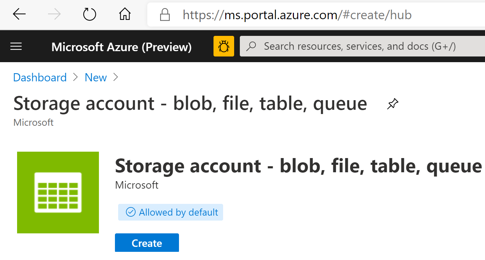
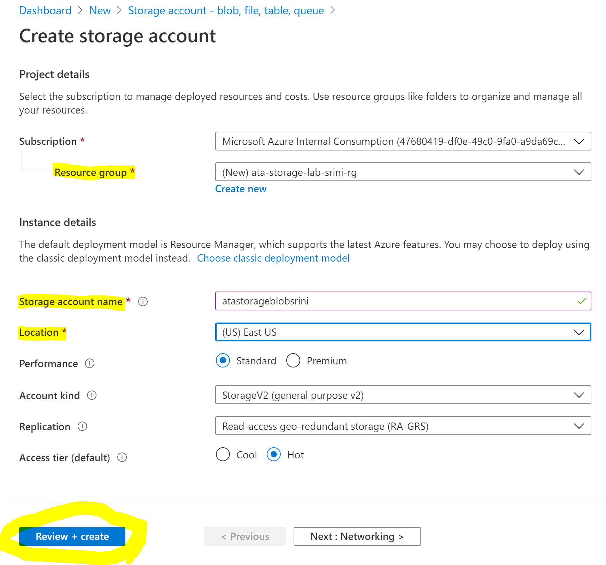
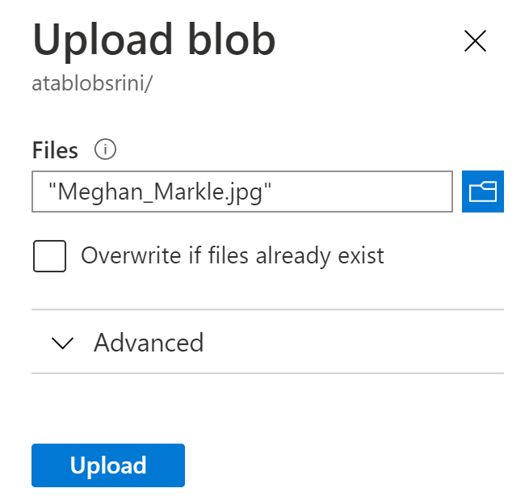

# Azure Trailblazer Academy Azure Storage Lab
## Overview
### Store Data in Azure
Blob storage is optimized for storing massive amounts of unstructured data. Unstructured data is data that doesn't adhere to a particular data model or definition, such as text or binary data. Azure Data Lake Storage Gen2 (ADLSGen2) offers a hierarchical file system as well as the advantages of Blob storage for Big Data Hadoop needs.

### Sharing data between the organizations
Share structured and unstructured data from multiple Azure data stores with other organizations in just a few clicks. There’s no infrastructure to set up or manage, no SAS keys are required, and sharing is all code-free. You control data access and set terms of use aligned with your enterprise policies. Use snapshot-based sharing to copy data from the data provider, or use in-place sharing to refer to data in the provider’s account.

## How to load data into Blob Storage? (Step-by-Step Lab)
### Step-1:Create Storage account
- Login to Azure Portal (https://portal.azure.com) 
    Select "create a resource" and select "Storage accounts" service. 
Hit 'create' button.

- Create a new resource group
    Select 'Create new' under 'Resource group' section. Enter "ata-storage-lab-<Name>-rg"

- Enter Storage account name
    Enter 'atastorageblob<yourname>' 
- Select the location
    Select 'East US' as the region
- Leave defaults for the rest
- Select 'Review + create' button
    Make sure you have completed all the entries high lighted in the diagram. It completes the validation checks.
    
- Select 'Create' button 
    Make sure you have the green check mark next to 'Validation Passed'. You are good to create the blob storage! Hit the 
    'Create' button. 
- Go to 'blob storage' from the deployment status screen
    Wait till you see 'Your deployment is complete'.
    Select 'go to resource' button when you see it.

### Step-2 Create container
- Select container
    locate the container from the available storage options and select the link.
    
- Create a new container
    Select the 'plus' sign next to container to add a new container
    'New container' window popsup and enter the name 'atablob<yourname>'
    ![Create Blob Container] (./images/Complete-create-blob-container.PNG)
### Step-3 Upload image to Blob container
- Access Storage Explorer
    Select the 'Storage Explorer(preview)' from the left blade
    Select the created blob container 
    Select upload button 
    Browse the local data and upload an imapge
      

# How to load data into Data Lake Storage? (Step-by-Step Lab)
# How to share Data between the organizations? (Step-by-Step Lab)