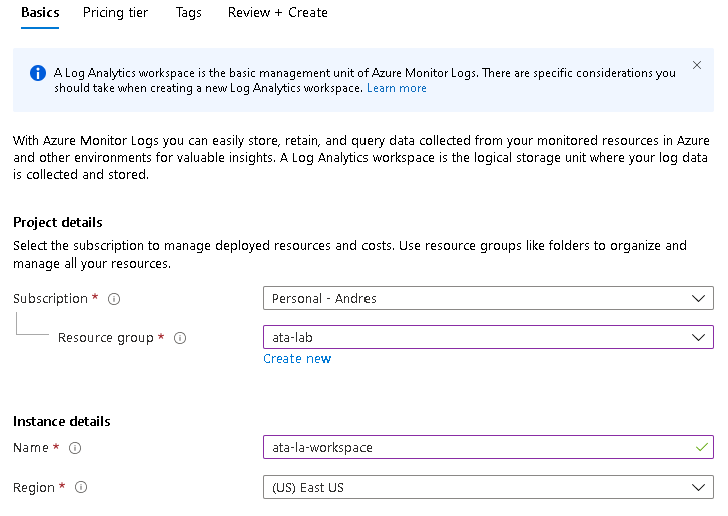
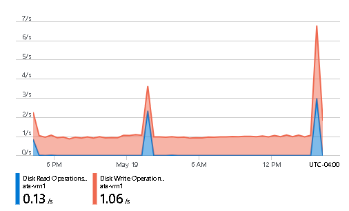
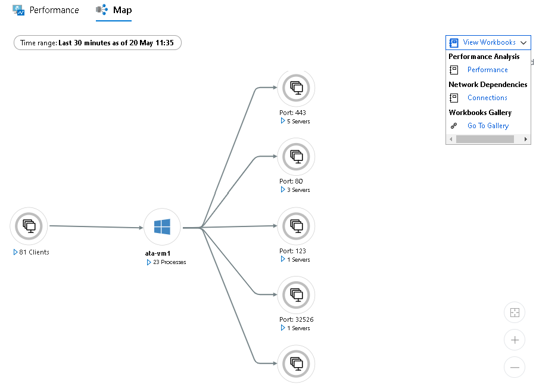
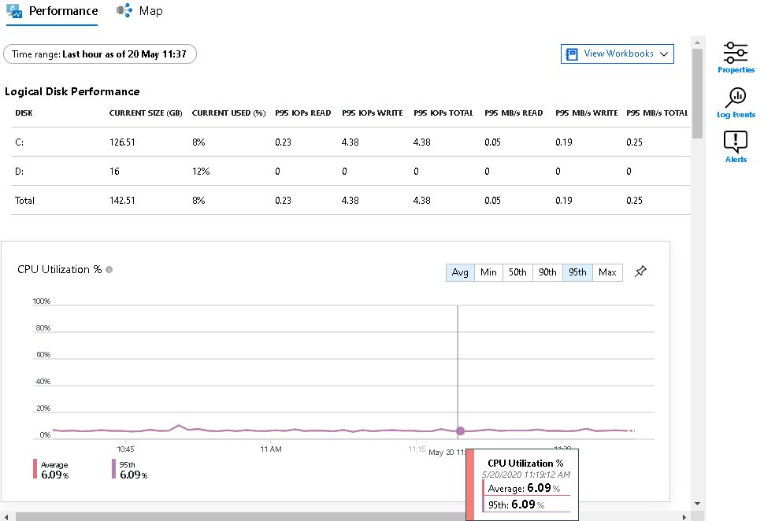
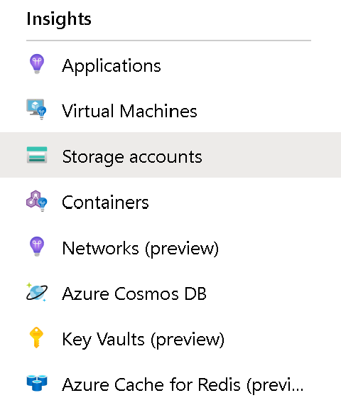
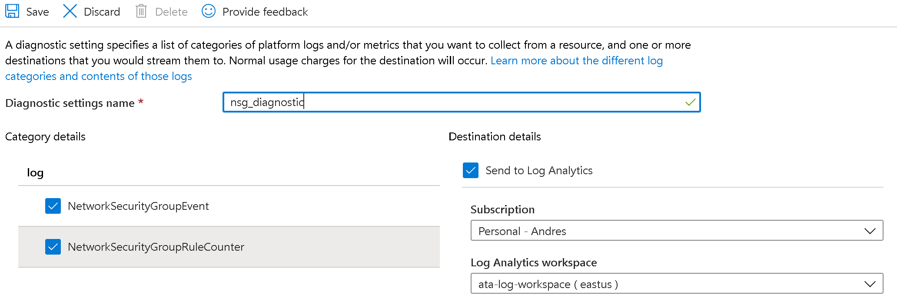
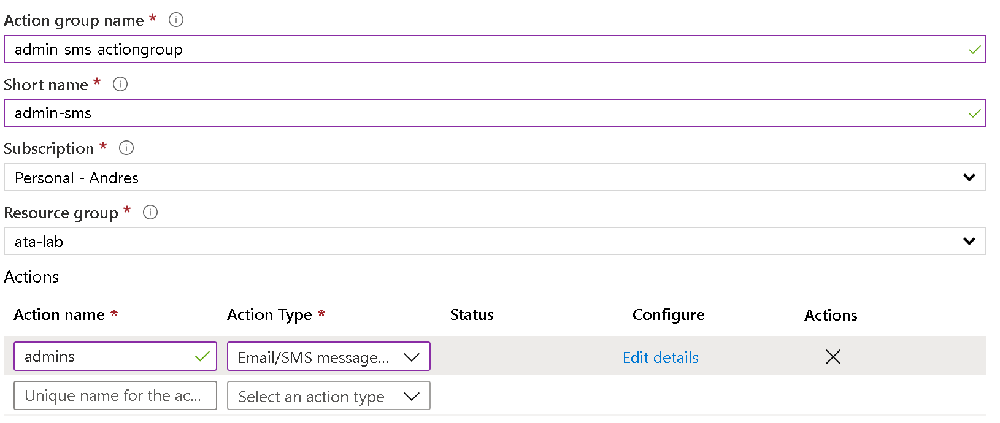
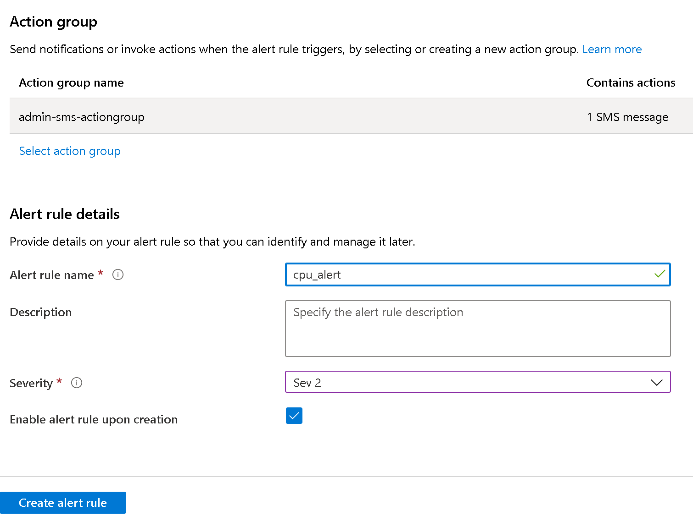

# Azure Monitoring Lab

## Prerequisites

- Microsoft Azure subscription
- Resource Group to deploy Azure services
- Permissions to create VMs with public IP addresses
- Deploy the environment to your resource group using the "Deploy to Azure" option below  

[](https://portal.azure.com/#create/Microsoft.Template/uri/https%3A%2F%2Fraw.githubusercontent.com%2Fmicrosoft%2FAzureTrailblazerAcademy%2Fmaster%2Fmonth2%2Flabs%2Flab_monitoring%2Ftemplate%2FAzureMonitorLab.json)  

** Note: This will deploy 2 VMs (Windows and Linux) to a new virtual network and attach a NSG to the subnet

## Lab Environment  

We will be monitoring the following environment using Azure Monitor.  


Monitoring Setup:  
1) Metrics  
    - Virtual Machines
2) Log Analytics
    - VM Insights (Windows and Linux VM)  
    - Diagnostic Settings  
-- Virtual Machines  
-- Network Security Groups  
-- Virtual Networks  


# Lab Setup

## Step 1: Deploy a Log Analytics Workspace

1. In the Azure Portal, search for **Log Analytics Workspaces**
2. Click on the **Add** button
3. Fill out the **Basics** tab as follows:
- **Subscription:** Choose your subscription
- **Resource Group:** Select the Resource Group you created for this lab.
- **Name:** Choose a unique name for Log Analytics Workspace. Ex: ata-la-workspace
- **Region:** East US




4. Click the **Review + Create** button
5. Click the **Create** button

## Step 2: Connect VM to Log Analytics Workspace  

1. On the search bar of the Azure Portal, look for **Log Analytics Workspace**. 

2. Open the blade for the workspace you created in Step 1

3. On the left blade, click on **Virtual Machines** under "Workspace Data Sources." 

  

4. Click on "Not connected" next to "ataubwvm\<initials\>. Then click on connect.  

  

5. Repeat the process for "atawinvm\<initials\> virtual machine. Now both the Linux VM and the Windows VM are reporting to your Log Analytics Workspace.  

## Step 3: Enable VM Insights

Follow these steps to enable VM Insights for the VMs created using the template. Since it takes a couple of minutes for VM Insights to be enabled, you can complete steps below and then move to the next section of the lab. You don't need to wait for that to finish to complete the next section **Metrics Monitoring**. Not that enabling VM Insights is the same process for either Linux or Windows virtual machines.  

1. Open the VM resource for "ataubwvm\<initials\> once it is provisioned
2. On the left blade, select **Insights**
3. Click on the **Enable** button
4. Repeat the process for "atawinvm\<initials\>
6. It will take a couple of minutes for VM Insights to be enabled. The VM will be configured to send logs and other performance data to the Log Analytics workspace.


## Step 3: Metrics Monitoring

1. On the left blade click on **Metrics**
2. On the top filter select the following:
- **Scope:** Leave as default. The VM name should be there.
- **Metric Namespace:** Virtual Machine Host
- **Metric:** Disk Read Operations/Sec
- **Aggregation:** Avg


3. On the **Time Range** (top right of the screen) and select the following:
- **Time Range:** Last 30 minutes
- **Time Granularity:** 1 minute
4. Click **Apply**. The chart should have been updated now to show the CPU percentage for the last 30 minutes.


5. You can add multiple metrics to the same chart so let's add a second one.
6. Click on **Add metric**
7. On the new filter that was created, select the following:
- **Scope:** Leave as default. The VM name should be there.
- **Metric Namespace:** Virtual Machine Host
- **Metric:** Disk Write Operations/Sec
- **Aggregation:** Avg
8. Click anywhere on the screen and you should now see two lines charts inside the same chart
9. Customize the apperance of the chart by click on the **Line Chart** button (at the top) and changing it to an **Area Chart**



10. Click on the **Pin to dashboard** button and select **Pin to current dashboard**
11. In the left-side menu of the Azure Portal, click on **Dashboard** and to see the chart that was just pinned

## Step 4: Log Monitoring and Advanced Guest OS Monitoring

If you need to analyse logs generated by your applications/Guest OS or monitor other performance metrics that are available only to the Guest OS(such as Memory available) you need to use Log Analytics. When you turned on **VM Insights** in Step 3, the VM was configured to send this logs/data to the Log Analytics workspace where the can be queried/analyzed by you and/or by other Azure solutions such as Azure Security Center or Azure Sentinel. Let's take a look at the data that has been collected so far.

1. Go back to your resource group and open the Virtual Machine
2. On the left menu, click on **Logs**. This will open the workspace that we can use to query the logs that have been collected and stored in the Log Analytics workspace you created in Step 1.
3. On the left side of the workspace, you should see a list of tables that can be queried such as Perf, Heartbeat, Syslog, etc.
4. On the right side, type the following to query all records from the **Heartbeat** table:

    ```
    Heartbeat
    ```
5. Click the **Run** button and you should see a list of recoreds for everytime this VM has sent a "keep-alive" or "heartbeat" message the Log Analytics Workspace within the last 24 hour.


5. We can also explore the processes that have been running on this VM buy querying the "VMProcess" table:

    ```
    VMProcess
    ```


6. Let's now explore the records for the "InsightsMetrics" table. That table contains useful performance metrics that are sent directly from the Guest Operating System. Type the following and then click **Run**:

    ```
    InsightMetrics
    ```
7. You will see many rows of data coming from different performance counters such as Processor, Memory and LogicalDisk. Let's execute the following query to filter the table and get metrics for "Available Disk Space" only:

    ```
    InsightsMetrics| where Name == "FreeSpaceMB" and Namespace == "LogicalDisk"| summarize AggregatedValue = avg(Val) by bin(TimeGenerated, 1min)
    ```

8. Sometime it is easier (and/or makes more sense) to look at a chart instead of rows of data. Let's execute the following query to create a chart of the "Available Memory" for this VM. Notice the "render timechart" at the end of the query:

    ```
    InsightsMetrics| where Name == "AvailableMB" and Namespace == "Memory"| summarize AggregatedValue = avg(Val) by bin(TimeGenerated, 1min) | render timechart
    ```


9. Some Azure services include pre-configured **Insights** that uses both, metrics and logs, to give you a customized monitoring experience for that particular service. Inside the VM resource, click on **Insights** on the left blade.

10. You will find two tabs: **Performance** and **Map**. Click on the **Map** tab to tsee a map of the processes running on the VM and the ports that it is communicating to/from.



11. Click on the **Performance** tab to see a list of pre-built performance charts from the different system counters.



12. On the right side of this screen, click on **Alerts** to see any alerts that have been recently triggered for this VM. We will be configuring alerts on Step 7 of this lab.

13. You can control the logs and performance counters that the Microsoft Monitoring (MMA) agent collects and sends to the Log Analytics Workspace. To do that, search for **Log Analytics Workspaces** on the search bar of the Azure Portal and click on the workspace that you created on step 1.

14. On the left blade, click on **Advanced Settings** and then click on **Data**.

15. Click on **Windows Event Logs** and, on the search bar, look for **System**. Select it and then click the add button.


This configuration will be pushed to all agents connected to this workspace and they will now start sending their System logs where they can then be analyzed centrally and used by other tools such Azure Sentinel and Azure Security Center.


## Step 5: Explore Azure Monitor and Connect other Azure Services

Azure Monitor is an Azure service that centralizes many of the different monitoring capabilities available in the platform.

1. On the search bar of the Azure Portal, look for **Monitor**. 

2. On the left blade you will see some of the services we have used to monitor the VM such as **Logs** and **Metrics**. However, in this view, the monitoring capabilites are no longer scoped to a single resource (such as the VM we were querying earlier). From this view,you can monitor any Azure services that are reporting to the metrics database or a Log Analytics Workspace.

3. On the left blade, click on **Activity Log**. Here you will find insights into the operations on each Azure resource in the subscription from the outside (the management plane) in addition to updates on Service Health events. Use the Activity Log, to determine the what, who, and when for any write operations (PUT, POST, DELETE) taken on the resources in your subscription. Feel free to "play around" with the filters and some of the settings on this page.

4. Back into the Monitor page, notice the **Insights** section. As mentioned earlier, Azure provides Insights for different Azure services. These Insights are pre-built monitoring dashboards and visualizations that use metrics and logs collected from the resources to display a customized monitoring experience such as the **VM Insights** that we explored on Step 5.

5. Click on **Storage Accounts** to see pre-configured Insights built for the Storage Account service.



6. The Azure Monitor service can also be used to enable log collection and detailed monitoring (a.ka Diagnostics) for other Azure services. Click on **Diagnostics settings**.

7. Click on the Network Security Group that was deployed for the VM. Then click on **+ Add diagnostic setting**.

8. Enter a name for this Diagnostics and then select the two types of logs available for Network Security Groups (NetworkSecurityGroupEvent and NetworkSecurityGroupRuleCounter). On the right side of this form, check **Send to Log Analytics** and select the Log Analytics Workspace that you created earlier.



9. Click **Save**. The logs generated by this Network Security Group will now be sent to the Log Analytics Workspace and those logs can be queried for troubleshooting purposes or used by other Azure services such as Azure Security Center to identify any potential vulnerabilities/intrusions.


## Step 6: Create an Alert

The last step of this monitoring lab is to create an alert for you to be notified when the CPU of the Virtual Machine suddenly spikes.

1. On the left blade of Azure Monitor, click on **Alerts** and then click the **+ New alert rule** button.

2. The first thing we'll configure is the **Scope** of the alert. Click on **Select resource**. On the form that pops up, select **Virtual Machines** on the **Filter by Resource Type** dropdown.

3. Select your Virtual Machine and click **Done**.

4. Now we need to configure the **Condition**. Click on **Select condition** and on the new form look for and select **Percentage CPU**.

5. Leave everything default here and on the **Threshold** field select **Dynamic**. Then click **Done**.

6. Next step is to create an **Action Group**. An Action Group defines the "what should happen or who should be contacted" if the alert triggers. Click on **Select Action Group**.

7. Click on **Create Action Group**. Fill out that form as follows:

- **Action Group name:** Enter a unique name for this action group (ex: admin-sms-actiongroup)
- **Short name:** Enter a unique name. This is the name of the action that will be seen by SMS recipients.
- **Subscription:** Select your subscription
- **Resource Group:** Select the resource group where you want to create this action group.
- **Action Name:** Enter a unique name for the action. (Ex:admins)
- **Action Type:** Email/SMS message/Push/Voice



8. Click **Edit details**. Check the **SMS** checkbox and enter a phone number where you want to be contacted. Click **OK** and then click **OK** again on the Action Group form.

9. Enter a name in the **Alert rule name** field and select a **Severity** of 2. Then click **Create alert rule**.



The alert has been created and it should show up now when you click **Manage Alerts** in the Azure Monitor page.

When the CPU percentage of the VM spikes (based on historical trends), this alert will trigger and you will receive an SMS alerting you of that.
